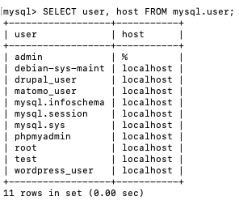
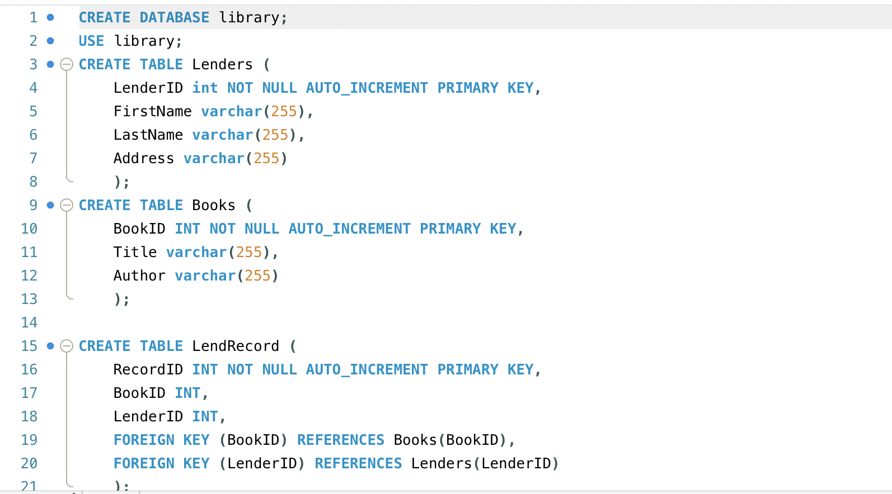
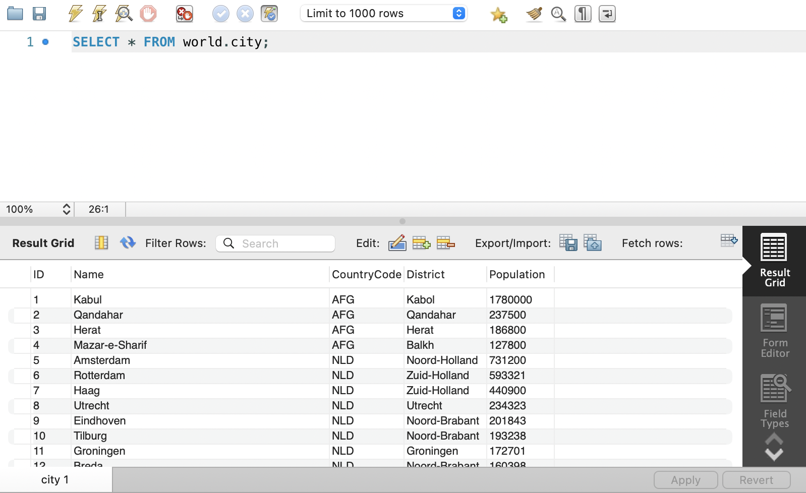
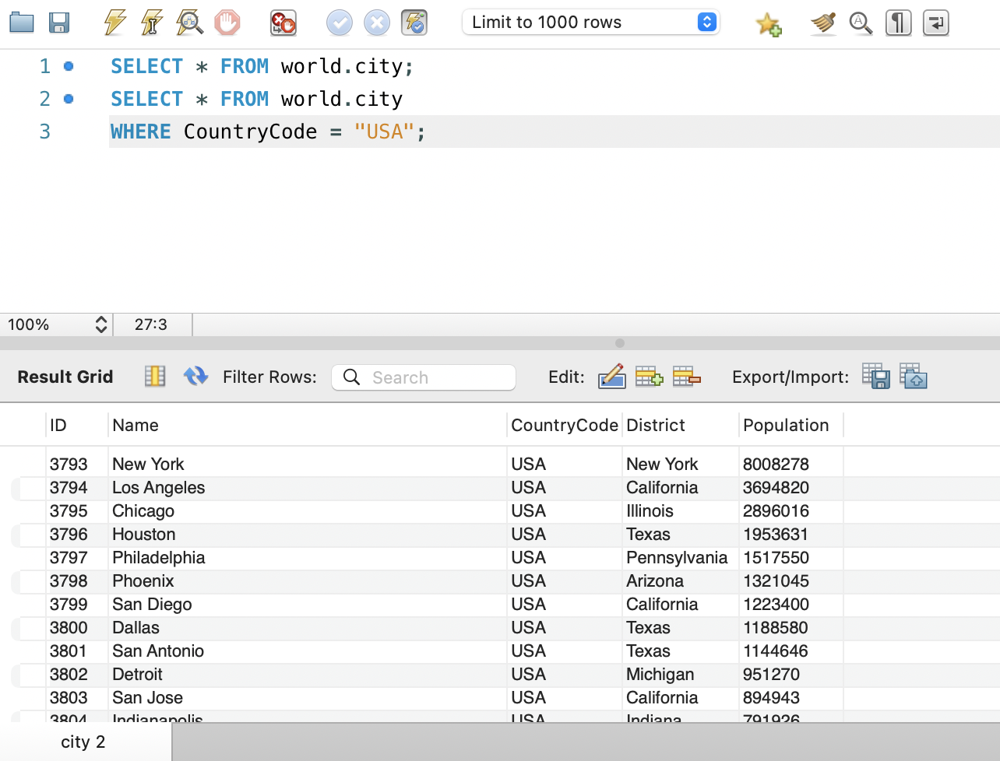
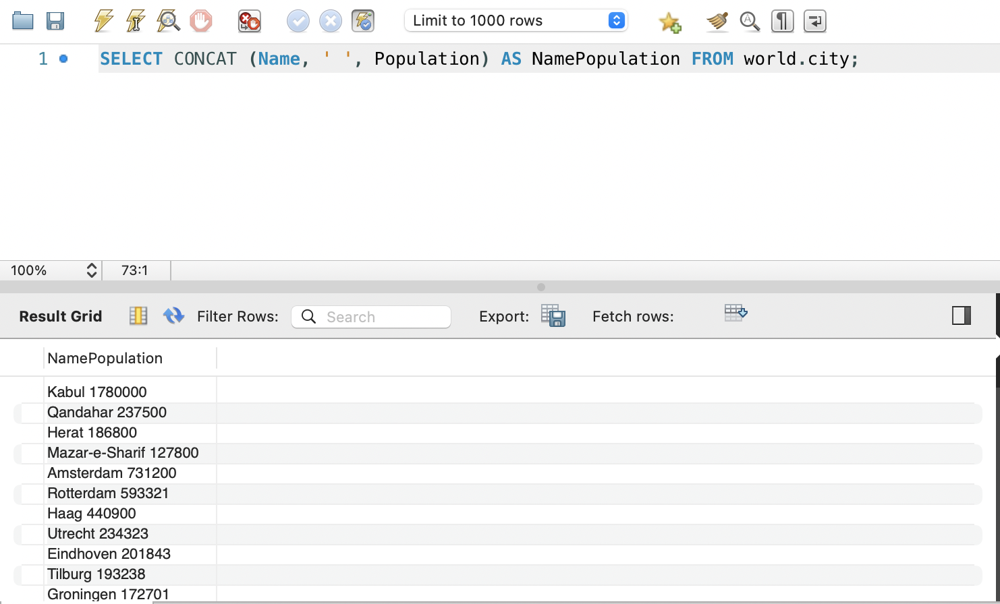

# MySQL CheatSheet
_This guide contains specific references for Mac users and Ubuntu operating system._

## Getting Started: Login
The first step is to open the terminal interface on your computer. The terminal gives us access to the command line where we can remote access our database and navigate to the MySQL shell.
  
The terminal can be found in your Dock or through search in your launchpad.

### Remote Machine Access
If you are working with a remote server and are using an unsecured network such as the internet to access, use an SSH tunnel to encrypt the connection.
Enter the following command in your terminal:

`ssh your_username@your_server_ip`

### Local Machine & Direct Conenction Access
If you are working with a remote server and have direct secure access or are working on a local machine, use the following code:

`mysql --host=localhost --user=myname --password mydb
mysql -h localhost -u myname -p mydb`

Note that you do not enter your password in the command line. This is for security reasons. Other users on your system can find your password in the command line history. In the code above, you will be prompted to enter your password instead. 

### Logging In
If this is your first time logging into MySQL you will first need to check if MySQL is installed with the following command:

`mysql --version`

If you receive a message that the command is not found, run the following code to install mysql:

```
sudo apt-get update
sudo ap install mysql-server
sudo systemctl start mysql
sudo systemctl enable mysql
```

If this is not your first time logging in simply enter the following command, you'll be prompted to enter your password.

`sudo mysql -u root -p`

## Users
Before getting into how to view and create users, let's understand first how MySQL stores this type of data. MySQL is an opensource data storage system that uses relational management to structure its database. It uses SQL (Structured Query Language), a language designed for relational databases, to execute its functions. 

**_What is a relational database?_**


Data is stored in the form of tables, each structured with defined columns. These columns serve as categories for different types of information, and data is inputted into the tables in rows. This tabular arrangement facilitates the relational type structure we talked about between different pieces of data. This is what is happening when we want to show our mysql users, we are querying a table where data is arranged into columns and populated in rows.

**_Tables, columns, and rows are the building blocks of a MySQL database_**

#### Show Users
`SELECT user, host FROM mysql.user;`

  

In this code snippet, we are selecting the columns called _user_ and _host_ from the _user_ table in the _mysql_ database.

#### Create Users and Grant Privileges

Anytime you want to create a new user, you'll have to decide how much access each user gets. In the code below we are granting all privileges to our new user. 

```
CREATE USER 'username'@'localhost' IDENTIFIED BY 'password';

GRANT ALL PRIVILEGES ON *.* TO 'username'@'localhost' WITH GRANT OPTION;

FLUSH PRIVILEGES;
```
You can also choose to grant only some permsissions, here are some common ones:

* SELECT
* INSERT
* UPDATE
* DELETE
* CREATE
* DROP

There are specific permisissions for essentially every MySQL command.

If a user has already been created and granted permissions and you just want to see what those are or delete them, use the following commands:

`SHOW GRANTS FOR 'your_username'@'your_host';
`

or just `SHOW GRANTS;` if the user is already logged in.

`REVOKE privilege_name ON database_name.* FROM 'username'@'host';
`

`REVOKE ALL PRIVILEGES ON database_name.* FROM 'username'@'host';
`

## Databases
You can create a database for each application or set of data that you wish.  

`CREATE database_name;`

Then you'll need to make sure it's selected.

`USE database_name;`

## Tables

As mentioned, tables are one of the buiding blocks of MySQL. 

To display existing tables 

`SHOW TABLES`

To delete a table

`DROP TABLE table_name`

## Columns and Rows

Whenever you are creating a table for the first time, its a good idea to enter in all of your coluns and rows at the same time. You'll also identify the datatype of each row as well. It will look something like this:



LenderID and FirName are row names delienated with the value-type VARCHAR with max 255 characters. There are other datatypes you can set such as INT which stands for integer or number.

Remember that data is entered into rows and columns organize that data. To add data you can insert into a single row or multiple rows at once.

`INSERT INTO table_name (column1, column2) VALUES (value1, value2);

INSERT INTO table_name (column1, column2) VALUES (value1, value2), (value1, value2);
`
The above two "INSERT INTO" commands create both the columns and the rows. 

To delete an individual row:

`DELETE FROM table_name WHERE column_name = 'value';
`

To update a row:

`UPDATE table_name SET column1 = 'new_value' WHERE column2 = 'value';
`
If you have already created a table you can add new columns or modify existing ones with the following:

`ALTER TABLE table_name ADD COLUMN new_column_name datatype;
`
`ALTER TABLE table_name MODIFY COLUMN column_name new_datatype;
`

## Selecting Data

You can return all data with the following statement:

`SELECT * FROM table_name`

The asterick means 'all'.

Let's say we have a database called 'world'. In that database we have a table called city that would like the following in MySQL Workbench.

  

See how I selected the data? We'll use this in some examples below.

### WHERE Clause

You can select data based on a condition. Conditions are essentially just specifications for your search selection to narrow down the amount of data returned to only what you need to see. Wherever you can, you want to ask the server to perform less tasks. If your server is constantly retrieving all of its stored data and lets say you have thousands of users making these calls at once, you will break your server.

`SELECT * FROM world.city WHERE CountryCode = "USA";
`

Instead of displaying all of the cities like in the picture above, we would only return the cities that have the value of "USA" in the column called "CountryCode"

  

### Selecting a Range of Data

What if you want to select data within a certain value range?

`SELECT * FROM world.city WHERE population BETWEEN 670000 AND 700000;` 

This returns the following cities: Teresina, Natal, Bandar Lampung, Gwailor, Kermanshah, Palermo, Toronto, Huainan, Jixi, Antananarivo, Chihuahua, Kano, Tunis.

### The IN Operator

The IN operator allows you to search for a more specific range of values or filter based on discrete values.

`SELECT Name FROM world.city WHERE CountryCode IN ('AFG','NLD');`

### The ORDER BY Operator

You can also order data by its columns using the ORDER BY command. This will return rows in ascending (defualt) or descending order. For rows that are strings (remember when we delienated VARCHAR?) ASC would be alphabetical from A to Z. For numerical data, this would from smallest to largest.

`SELECT * FROM world.city ORDER BY Population ASC;`

This data would return alphabetical from A to Z.

`SELECT * FROM world.city ORDER BY Population DESC LIMIT 10;`

This data would return numerical from largest to highest. We've also limited the return results to 10. Remember when we mentioned the importance of returning only the data needed? Here is an example of one of the built-in commands to do just that.

### Duplicate Data

Sometimes data is duplicated in a table. To return only unique row values you can use the DISTINCT command.

`SELECT DISTINCT * FROM world.city;
`
### Concatting Data

You can combine column values:

SELECT CONCAT(column1, ' ', column2) AS concatenated_column FROM table_name;

In our example it would look like this:

`SELECT CONCAT (Name, ' ', Population) AS NamePopulation FROM world.city;`

  

 ### The LIKE Operator

You can also make searches using the LIKE operator. This searches by pattern such as all the cities that start with the letter "Kal". 

`SELECT * FROM world.city WHERE Name LIKE 'kal%';`

Returns: Kalookan, Kalyan, Kalernie Kallithea, Kalisz, Kaliningrad, Kaluga

## Summary

This is not an exhaustive list of all the possibiliites of MySQL. There is still lots more you can do! This guide explains the basics and the jist of how operators work. Here is a link to the full MySQL documentation guide. Hopefully my explanations here makes the official guide easier to follow! 

[MySQL Official Guide](https://dev.mysql.com/doc/refman/8.0/en/indexes.html)


